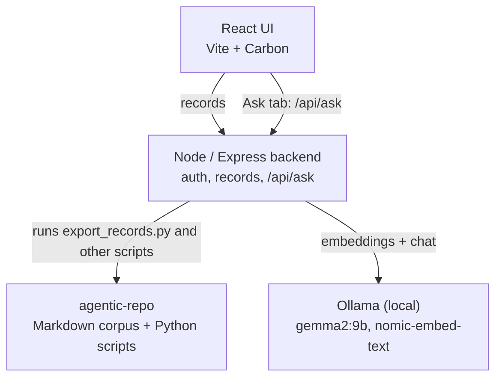
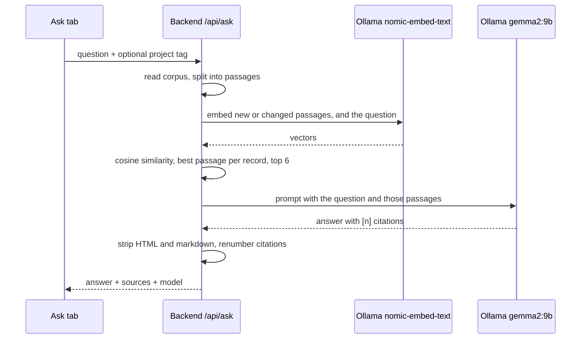
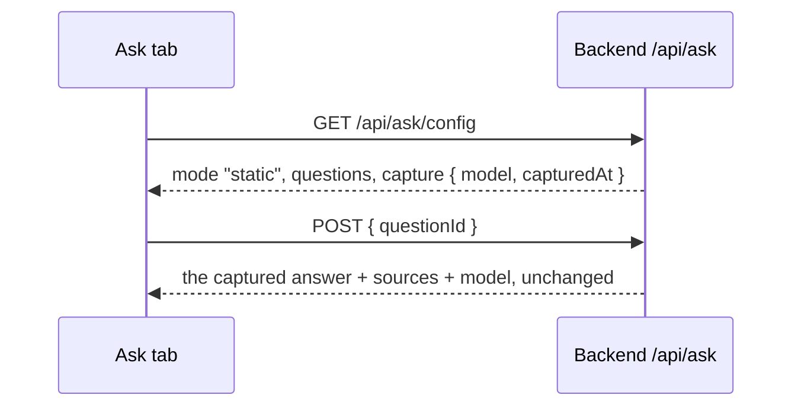

# Architecture

How the UX Research Repo app fits together. Current as of 2026-09-28; the
"Known gaps" section at the bottom lists what isn't finished yet.

## The pieces

Every arrow works today. The Ask tab reads `GET /api/ask/config` for whether
the server can answer and for the project list, and asks questions with
`POST /api/ask`. Where `LLM_PROVIDER` is unset it says Ask the Repo isn't
available and disables asking. With `LLM_PROVIDER=static` (the public demo)
there is no model at all: see [static mode](#the-ask-tab-in-static-mode-the-public-demo).
On a dev server (`DEV_TOOLS_ENABLED=true`, `NODE_ENV` development or test) a
Dev toggle on the Ask page switches between the two without a restart; it
isn't in the production build, and its route isn't registered in production
(see [decision 14](./decisions.md#14-a-dev-only-switch-between-static-and-live-answers)).

## Where things live

| Piece | Repo / location | Notes |
|---|---|---|
| React UI | this repo, `frontend/` | Vite, Carbon, Vitest |
| Backend | this repo, `backend/` | Node/Express, Jest. Shells out to the Python scripts in agentic-repo |
| End-to-end tests | this repo, `e2e/` | Playwright, run against a throwaway repo built from `e2e/fixtures/corpus/` |
| Corpus + scripts | `agentic-repo` (separate repo) | Markdown records plus `export_records.py`, `build_index.py`, `build_search_ui.py` |
| Local dev clone | a sibling clone, `agentic-repo-dev` | Push disabled. The backend's `AGENTIC_REPO_ROOT` points here so local use can't commit to the real repo |
| Models | Ollama, on the developer's machine | `gemma2:9b` for answers, `nomic-embed-text` for embeddings |

Corpus edits are made in the real `agentic-repo` checkout, never in the dev
clone.

## How a question gets answered (`POST /api/ask`)

Details worth knowing:

- **Passages.** Records are split into passages of up to about 600
  characters that never cross a heading, so each citation can show real text
  before and after the excerpt.
- **Caching.** Nothing happens at startup. The first question embeds the
  whole corpus (about 500 passages; roughly 9 seconds cold in testing).
  Embeddings are kept in memory, keyed by a hash of each passage's text, so
  later questions only embed the question plus anything that changed. The
  cache resets when the server restarts.
- **Retrieval.** Brute-force cosine similarity, keeping each record's best
  passage. No vector database at this corpus size.
- **Project filter.** Matches by tag, because records have no project field.
  The Ask tab's picker lists the `project-*` tags from `GET /api/ask/config`
  (labels from the corpus's `research/projects.yml`), with the selected
  one's record count as helper text under it. A project matches its own tag
  only, so cross-cutting records are searched only under "Cross-cutting" or
  "All projects". The "All projects" count adds up the project counts, so
  it leaves out any record without a project tag, which an all-projects
  search still covers. agentic-repo requires the tag, so the two agree.
- **Gate.** `LLM_PROVIDER=ollama` turns the endpoint on, and `static` serves
  captured answers instead (below). Unset returns 503; any other value stops
  the server from starting.
- **Output.** The model's text is flattened to plain text on the server
  before it is returned. `[n]` always refers to `sources[n-1]`.
- **Response shape.** Documented in
  [`backend/README.md` under "Ask the Repo (v1.3.6)"](../backend/README.md#ask-the-repo-v136).
- **Failures.** Ollama errors are logged server-side and returned as a
  generic 502.

## The Ask tab in static mode (the public demo)

The public demo runs no model. With `LLM_PROVIDER=static`, the server answers
from `backend/ask/static/answers.json`: a curated list of questions, each
with a real, unedited answer from a local `gemma2:9b` run, captured ahead of
time by `backend/scripts/capture-static-answers.js`.

- **No typing.** When the config says `mode: "static"`, the composer is
  replaced by a question picker. The empty state lists the questions in the
  starter-question style; once a conversation has started, a "Choose a
  question" dropdown sits where the composer was. Picking one asks it at
  once, by id. The server rejects free text with a 400.
- **Project filter.** The project dropdown filters the list by each
  question's own project, an exact match like the live filter. "All
  projects" lists every question; a project with none isn't offered. The
  picker shows no record counts, since nothing is searched.
- **Honest about it.** An "Answers are pre-generated" info banner (a
  Carbon `Callout`, so no live region) is the chat panel's first row, above
  the scrolling thread, so it stays in view before and after a question is
  picked. It names the model and capture date from the config and links
  "run the project locally" to the README's Getting started section.
  There's no simulated delay, typing effect or fake progress, and no "first
  question is slow" hint.
- **Everything else is live.** Answers go through the same `useAskRepo`
  flow as live ones, so citations, the source modal, Save as insight, the
  sources rail, the session-only history and the screen reader
  announcements all work unchanged.
- **Staying accurate.** Answers quote records by id, so they can drift
  from the corpus. `capture-static-answers.js verify` checks every cited
  record still exists and still contains its excerpt, against whichever
  clone `AGENTIC_REPO_ROOT` points at, including the demo server's.

## Known gaps

- Ask shows "not available" where `LLM_PROVIDER` is unset. The public demo
  shows it until its server sets `LLM_PROVIDER=static`.
- Correction files in `raw/` aren't read by the export scripts, so
  retrieval can still cite a number that a correction has fixed.
- Retrieval quality: numbered lists lose their numbers when chunked, the
  wrong passage is sometimes chosen, and the model occasionally states
  figures that aren't in the sources.
  `backend/scripts/eval-ask.js` measures this against a gold set; the
  baseline is `backend/ask/eval/results/baseline.md`.
- No rate limiting or quotas on `/api/ask`.
- The public demo can only answer its captured questions; typed questions
  need the project running locally.
