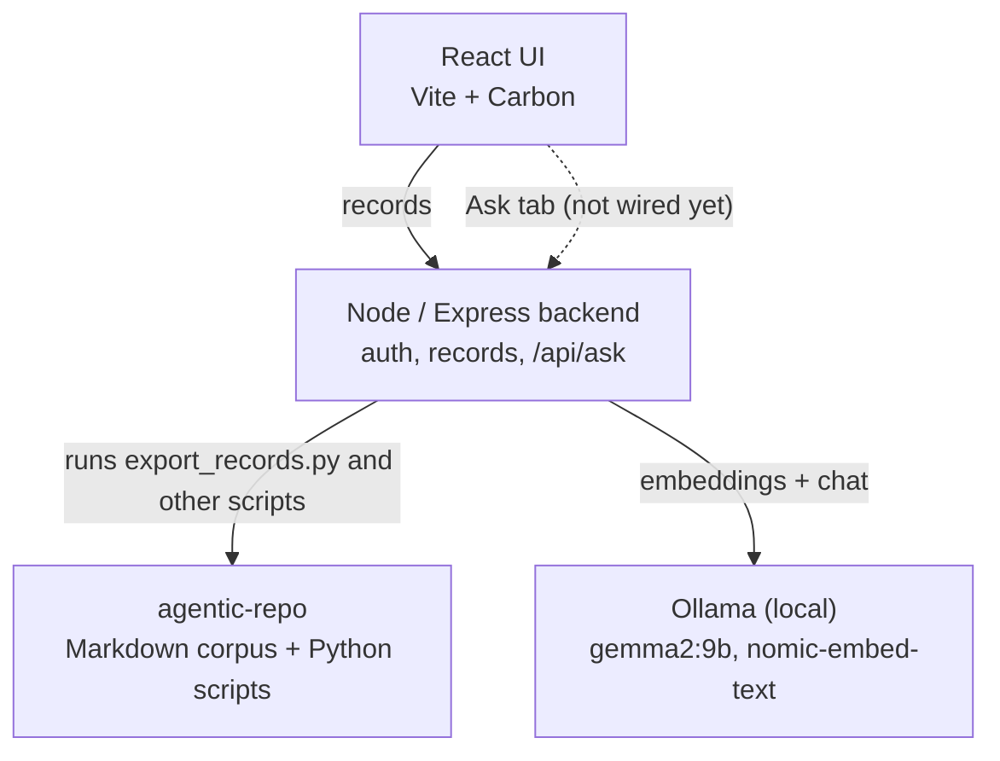
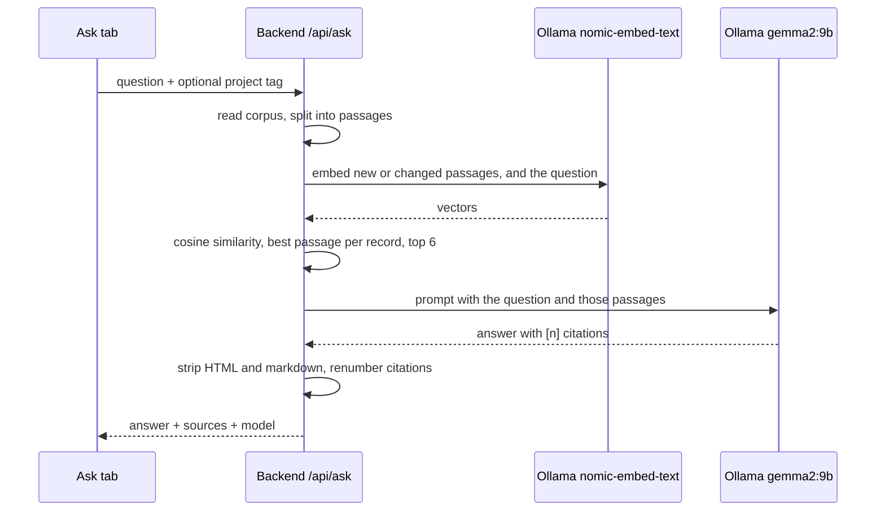

# Architecture

How the UX Research Repo app fits together. Current as of 2026-09-27; the
"Known gaps" section at the bottom lists what isn't finished yet.

## The pieces

Solid arrows work today. The dashed arrow is the Ask tab talking to
`/api/ask`; the endpoint exists, but the tab still shows mock data until
it is wired up.

## Where things live

| Piece | Repo / location | Notes |
|---|---|---|
| React UI | this repo, `frontend/` | Vite, Carbon, Vitest |
| Backend | this repo, `backend/` | Node/Express, Jest. Shells out to the Python scripts in agentic-repo |
| End-to-end tests | this repo, `e2e/` | Playwright, run against a throwaway repo built from `e2e/fixtures/corpus/` |
| Corpus + scripts | `agentic-repo` (separate repo) | Markdown records plus `export_records.py`, `build_index.py`, `build_search_ui.py` |
| Local dev clone | a sibling clone, `agentic-repo-dev` | Push disabled. The backend's `AGENTIC_REPO_ROOT` points here so local use can't commit to the real repo |
| Models | Ollama, on the developer's machine | `gemma2:9b` for answers, `nomic-embed-text` for embeddings |

Corpus edits are made in the real `agentic-repo` checkout, never in the dev
clone.

## How a question gets answered (`POST /api/ask`)

Details worth knowing:

- **Passages.** Records are split into passages of up to about 600
  characters that never cross a heading, so each citation can show real text
  before and after the excerpt.
- **Caching.** Nothing happens at startup. The first question embeds the
  whole corpus (about 500 passages; roughly 9 seconds cold in testing).
  Embeddings are kept in memory, keyed by a hash of each passage's text, so
  later questions only embed the question plus anything that changed. The
  cache resets when the server restarts.
- **Retrieval.** Brute-force cosine similarity, keeping each record's best
  passage. No vector database at this corpus size.
- **Project filter.** Matches by tag, because records have no project field.
- **Gate.** `LLM_PROVIDER=ollama` turns the endpoint on. Unset returns 503;
  any other value stops the server from starting.
- **Output.** The model's text is flattened to plain text on the server
  before it is returned. `[n]` always refers to `sources[n-1]`.
- **Response shape.** Documented in
  [`backend/README.md` under "Ask the Repo (v1.3.6)"](../backend/README.md#ask-the-repo-v136).
- **Failures.** Ollama errors are logged server-side and returned as a
  generic 502.

## Known gaps

- The Ask tab isn't wired to `/api/ask` yet.
- Correction files in `raw/` aren't read by the export scripts, so
  retrieval can still cite a number that a correction has fixed.
- Retrieval quality: numbered lists lose their numbers when chunked, the
  wrong passage is sometimes chosen, and the model occasionally states
  figures that aren't in the sources.
- No rate limiting or quotas on `/api/ask`.
- The public demo has no live LLM path yet; a static Q&A picker is planned.
